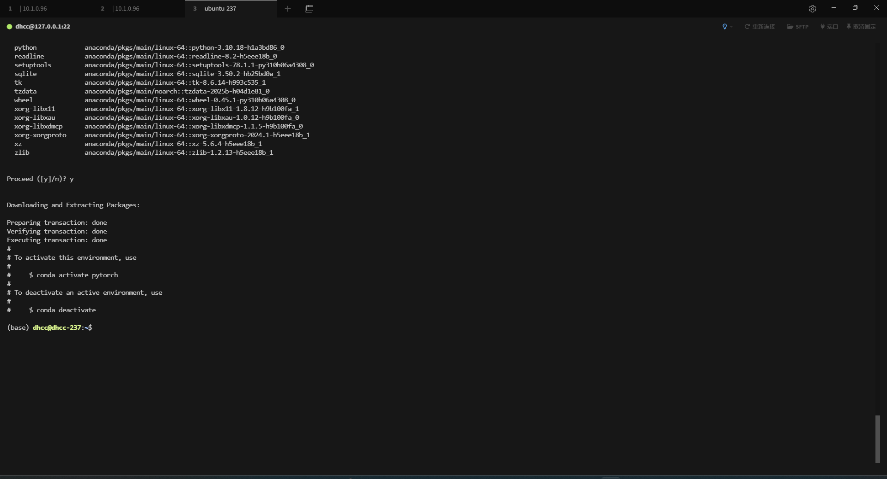
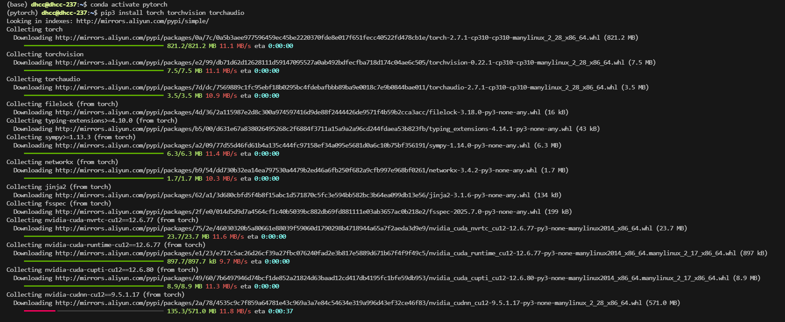

# 1.2 PyTorch的安装

PyTorch的安装是我们学习PyTorch的第一步，也是经常出错的一步。在安装PyTorch时，我们通常使用的是**Anaconda/miniconda+Pytorch**+ IDE 的流程。

## 1.2.1 Anaconda的安装

在数据科学和最近很火的深度学习中，要用到大量成熟的package。我们一个个安装 package 很麻烦，而且很容易出现包之间的依赖不适配的问题。而 Anaconda/miniconda的出现很好的解决了我们的问题，它集成了常用于科学分析（机器学习， 深度学习）的大量package，并且借助于conda我们可以实现对虚拟Python环境的管理。

### Step 1：安装Anaconda/miniconda

```bash
#下载安装脚本
wget http://repo.anaconda.com/archive/Anaconda3-2025.06-0-Linux-x86_64.sh
​#赋予执行权限并运行脚本​
chmod +x Anaconda3-2025.06-0-Linux-x86_64.sh  # 添加执行权限
bash Anaconda3-2025.06-0-Linux-x86_64.sh       # 运行安装脚本
source ~/.bashrc   # 立即生效环境变量
```


### Step 2：检验是否安装成功

```bash
conda --version # 显示版本号
```

### Step 3：创建虚拟环境

#### 创建虚拟环境

在深度学习和机器学习中，我们经常会创建不同版本的虚拟环境来满足我们的一些需求。下面我们介绍创建虚拟环境的命令。

```bash
conda create -n env_name python==version 
# 注：将env_name 替换成你的环境的名称，version替换成对应的版本号，eg：3.10 
conda create -n pytorch python=3.10
```




#### 激活环境命令

```bash
conda activate pytorch
# 注：env_name 替换成对应的环境的名称
```

#### 退出当前环境

```bash
conda deactivate
```

### Step 4：换源

#### pip换源

##### Linux：

```bash
cd ~
mkdir .pip/
vim pip.conf
```

随后，我们需要在`pip.conf`添加下方的内容:

```bash
[global]
index-url = http://mirrors.aliyun.com/pypi/simple/e
[install]
use-mirrors =true
mirrors = http://mirrors.aliyun.com/pypi/simple/
trusted-host = mirrors.aliyun.com
```

#### conda换源（清华源）

##### Linux系统：

在Linux系统下，我们还是需要修改`.condarc`来进行换源

```bash
cd ~
vim .condarc
```

输入以下内容：

```
channels:
  - defaults
show_channel_urls: true
default_channels:
  - https://mirrors.tuna.tsinghua.edu.cn/anaconda/pkgs/main
  - https://mirrors.tuna.tsinghua.edu.cn/anaconda/pkgs/r
  - https://mirrors.tuna.tsinghua.edu.cn/anaconda/pkgs/msys2
custom_channels:
  conda-forge: https://mirrors.tuna.tsinghua.edu.cn/anaconda/cloud
  msys2: https://mirrors.tuna.tsinghua.edu.cn/anaconda/cloud
  bioconda: https://mirrors.tuna.tsinghua.edu.cn/anaconda/cloud
  menpo: https://mirrors.tuna.tsinghua.edu.cn/anaconda/cloud
  pytorch: https://mirrors.tuna.tsinghua.edu.cn/anaconda/cloud
  simpleitk: https://mirrors.tuna.tsinghua.edu.cn/anaconda/cloud
```


我们可以通过`conda config --show default_channels`检查下是否换源成功，如果出现下图内容，即代表我们换源成功。


同时，我们仍然需要`conda clean -i` 清除索引缓存，保证用的是镜像站提供的索引。

## 1.2.2 查看显卡

### linux：


## 1.2.3 安装PyTorch

### Step 1：登录[PyTorch官网](https://pytorch.org/)


### Step 2：Install


这个界面我们可以选择本地开始（Start Locally），云开发（Start via Cloud Partners)，以前的Pytorch版本（Previous PyTorch Versions），边缘端开发（PyTorch for Edge），在此处我们需要进行本地安装。

### Step 3：选择命令

我们需要结合自己情况选择命令并复制下来，然后使用conda下载或者pip下载（建议conda安装）

打开`Terminal`，输入`conda activate env_name`(env_name 为你对应的环境名称)，切换到对应的环境下面，我们就可以进行PyTorch的安装了。

### Step 4：在线下载

```bash
conda activate pytorch
pip3 install torch torchvision torchaudio
```



#### Step 5：检验是否安装成功

进入所在的**虚拟环境**，紧接着输入`python`，在输入下面的代码。

```python
import torch

torch.cuda.is_available()
```

这条命令意思是检验是否可以调用cuda，如果我们**安装的是CPU版本的话会返回False，能够调用GPU的会返回True**。一般这个命令不报错的话就证明安装成功。


