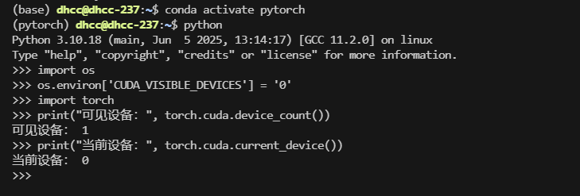
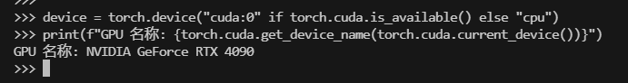

数据和模型如果没有经过显式指明设备，默认会存储在CPU上，为了加速模型的训练，我们需要显式调用GPU，一般情况下GPU的设置有两种常见的方式：

```python
# 方案一：使用os.environ，这种情况如果使用GPU不需要设置
import os
os.environ['CUDA_VISIBLE_DEVICES'] = '0' # 指明调用的GPU为0号

# 方案二：使用“device”，后续对要使用GPU的变量用.to(device)即可
device = torch.device("cuda:0" if torch.cuda.is_available() else "cpu") # 指明调用的GPU为0号
```






